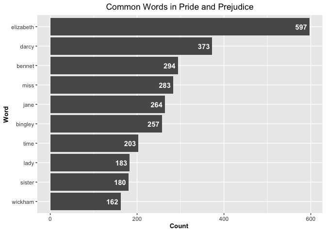

Assignment b04
================
Wenjie Jin

``` r
library(tidyverse)
library(tidytext)
library(janeaustenr)
library(palmerpenguins)
library(purrr)
library(testthat)
```

# Exercise 1

Take a Jane Austen book contained in the janeaustenr package, or another
book from some other source, such as one of the many freely available
books from Project Gutenberg (be sure to indicate where you got the book
from). Make a plot of the most common words in the book, removing “stop
words” of your choosing (words like “the”, “a”, etc.) or stopwords from
a pre-defined source, like the stopwords package or
tidytext::stop_words.

``` r
data <- tibble(Text = janeaustenr::prideprejudice)
words <- data %>% unnest_tokens(output = word, input = Text) 
## for the words, remove all stopwords using the function anti_join()
wordcounts <- words %>% anti_join(stop_words) %>% count(word, sort = TRUE)
```

    ## Joining, by = "word"

``` r
##head(wordcounts)

top_10 <- wordcounts %>% arrange(desc(n)) %>% head(10)
##head(top_10)
```

Then try to plot the most common words

``` r
top_10 %>% 
    ggplot(aes(reorder(word,n), n)) + geom_col() + coord_flip() +
    labs(x = "Word", y = "Count ", title = "Common Words in Pride and Prejudice") +
    geom_text(aes(label = n), hjust = 1.2, colour = "white", fontface = "bold") +
    theme(plot.title = element_text(hjust = 0.5), 
        axis.title.x = element_text(face="bold", size = 10),
        axis.title.y = element_text(face="bold", size = 10))
```

<!-- -->

# Exercise 2

Make a function that converts words to your own version of Pig Latin.
Need to have the following two components:

1.  Rearrangement component

2.  Addition component

``` r
#' Translate word to My Pig Latin
#'
#' The pig list consists of both lower case and upper case p, i, and g 
#' 
#' The rule of my pig latin is as the following:
#' 
#' 1. Find the first occurrence of one Pig Letter. Then from that first occurrence to the end of the word, we remove this part from the input string and reverse it and put it to the front of the word.
#' 2. Add the word PIG at the end of the reversed part 
#'
#' @param word A character string to be translated
#'
#' @return A character string in my Pig Latin format
convert <- function(word) {
  stopifnot(class(word) == "character")
  addition_word = "PIG"
  pig <- c("p", "i", "g", "P", "I", "G")
  letters <- str_split(word, "")[[1]] 
  ##find the first occurrence of the pig 
  first_pig <- detect_index(letters, ~.x %in% pig)
  if(first_pig < 1) return (word)
  len = length(letters)

  rest_part = substr(word, first_pig, len)
  splits <- strsplit(rest_part, "")[[1]]
  reversed <- rev(splits)
  reversed_cons <- paste(reversed, collapse = "")
  newWord = str_c(reversed_cons, addition_word, substr(word, 1, first_pig - 1))
  
  return (newWord)
}
```

``` r
# try to run our pig Latin using the following examples 
convert("god") # no Pig Letter
```

    ## [1] "dogPIG"

``` r
convert("print") # first Pig Letter is i
```

    ## [1] "tnirpPIG"

``` r
convert("PIG") # first Pig Letter is p
```

    ## [1] "GIPPIG"

``` r
# Test the function
test_that("Test1", {
  expect_equal(convert("god"), "dogPIG")
})
```

    ## Test passed 🥳

``` r
test_that("Test2", {
  expect_equal(convert("print"), "tnirpPIG")
})
```

    ## Test passed 🎊

``` r
test_that("Test3", {
  expect_equal(convert("PIG"), "GIPPIG")
})
```

    ## Test passed 🥳
